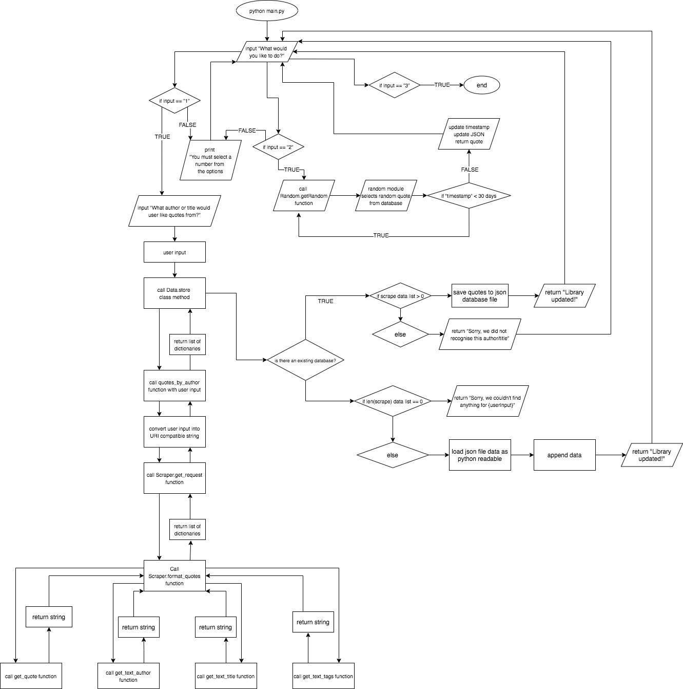

## CHECK YOUR HEAD

For a daily dose of thought provoking quotes from writers, thinkers and artists that have shaped your life or ones who may in the future. This app will provide you with quotes from the Good Reads website, via scraping with a custom database compiled with authors and titles you choose. You can access this database that will return a random quote from the library, with minimum repeats.


### Installation

To run CHECK YOUR HEAD, you will need to run it on Linux, Mac OS or Ubuntu on PC.

To install, please ensure you have:  
  
        Python 3.6+

### Usage

Upon running main.py, the user will be prompted with 3 options.

```
1 - Add an author/title
2 - Get a random quote
3 - Exit 
```

If user selects option 1, they will be asked to provide the name or title. This function is not case sensitive, and will provide feedback for source location.


```
What author or title would you like quotes from?
```

Once user has input the chosen author or title, the message below should appear.

```
Looking for quotes...
```
If the database was updated with content, the following message should appear.

```
Library updated!
```

If unsuccessful, the user should see this message.

```
Sorry, we did not recognise this author/title
```

If user selects option 2, and there is content within the database. It will return a quote from the JSON data file.

```
“The narcotic tobacco haze of Capitalism”  

- Allen Ginsberg
```

If there is no data in the JSON file, the following error message should occur, followed by the menu prompt to select an option.

```
Your database is empty, please add an author or title.

What would you like to do?

        1 - Add author or title
        2 - Get me a random quote
        3 - Exit

Select: 
```

If user selects option 3, a message will be printed to the screen and the program will exit.

```
Thank you for using Check Your Head!
```

If the user would like to stop the function, they can use KeyboardInterrupt command (ctrl + c) to stop the program.


### Development Overview

This application returns printed quotes from a locally stored database of user chosen authors and titles from the Good Reads website via a web scraper.  

The functions of this applications are:

**Web scraping data**
This is done via GET request to the URL of the quotes section of the Good Reads website.

**Storing data in local database**
This is a personal library that will allow the application to select a random quote from, and print it to the user screen.

**Select and print random quote**
The function allows the user to print a random quote from their database which will not allow the quote to be printed again for at least 30 days. This function exists to allow the app to be built upon, and for any developer interested in connecting an SMS or email API that will allow the quotes to be sent to a device of their choice.

#### Problem
There is no current API available to GET data from the quotes section, only an API to POST quotes.

#### Solution

The application begins by presenting the user with a selection of choices to determine what function they would like to execute.

This is executed with equality logical operators, which will prevent the user from selecting invalid keys.

```
1 - Add author or title
2 - Get me a random quote
3 - Exit
```

**Classes**
- **Data** - Functions that affect retrieving, storing or loading data
- **Scraper** - Functions related to assigning scraped data
- **Random** - Function that selects random data

```
1 - Add author or title
```


The function *add_author_or_title* allows the user to input a string that will call the *Data.store* function within the Data class. Within this function, it will then call upon the *requests* module package to change the format of the input string to be URI compatible for the GET request under the *quotes_by_author* function.

As the quotes by author function is called, it will call the function that contains the GET request, and use the BeautifulSoup module package to parse HTML data to store the text into a temporary variable. 

At this point, the format codes function structure is follows the master-slave pattern where the function distributes the work among slave components and its main focus is to return the final result of each return from the slave functions. Once the function starts to assign the quotes from the selected pages of the Good Reads website, we begin to see some repition introduced into the code structure inside specific class methods. This allows the quotes by author function to return a list of dictionaries that have run through the HTML text using bs4 module, to convert the data type into JSON.

The store function contains a selection control structure, which will check to see if the list returned contains elements or if it is empty. If the list contains elements, this means the GET request for the user input was successful, however, if it is empty, this will mean the GET request returned nothing and the search invalid for the user input. 

```
2 - Get me a random quote
```
The selection of input "2" is maintained by the selection control flow of checking if a file called "data.json" exists in the file structure. If it does not exist, the program will return a message that says:

        Your database is empty, please add an author or title.

This prevents the program from breaking and creating an error, after which it will take the user back to the main menu screen.

If the database is not empty, the function will proceed in a pip-filter pattern in that it will return a string in quotation from the JSON, using the json module package to load and select a random quote using the choice function from the random package module. After returning the string, it will then assign a timestamp of the moment it is selected using the time module. 

This is another function of the app that allows it to be modular, which will stop the app from returning a quote that is less than 30 days old since it was last selected (see project status for more info).

#### Flowchart

##### Packages Used
**Python Standard Modules**
- **os:** return stat infomation of file path
- **time:** use of time for checktimestamp function for 30 day grace period
- **json:** processing large database after web scrape
- **requests:** allowing API call to Good Reads endpoint
- **typing:** for type hint and error checking.
- **random:** using the choice function, to select a random element within a list.
- **config:** cross-reference between one part of the configuration for file path and another.

**Third-Party Modules**
- **langdetect:** detect if random quote is in English
- **bs4:** module to allow web scraping

### Project Status

The core functionality of this program is to webscrape text data from the GoodReads quote section of the website. The second part of it's functionality is to provide a random quote back to the user, which is timestamped and will not come across a duplicate quote for another 80 calls.

The core functionality and core is structured in that it can be built upon to suit the user's needs. A suggestion would be that if you would like to add to the code to forward the quotes to your personal email or SMS to your phone at set intervals.

Another bit of functionality that can be added in the future is the ability for a user to add their own quotes found from tangible sources into the database for later reference.